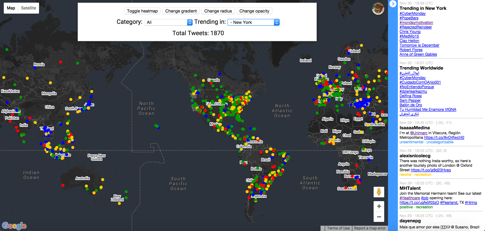

# TweetMapWeb


Temporary URL: [http://tweetmapweb-dev-dikb5tqspy.elasticbeanstalk.com/realtime.jsp](http://tweetmapweb-dev-dikb5tqspy.elasticbeanstalk.com/realtime.jsp)

## Creators :octocat: :dancers:
| UNI      | Github Username  | Full Name      |
|---------:|------------------|----------------|
|  nb2406  | blanksblanks     | Nina Baculinao |
|  mw2907  | MengyuWu         | Mengyu Wu      |

## Project Links on GitHub:

__tweetMapWeb__: Serves near Tweet Map in near real-time. Toggle button allows user to toggle between heatmap of data intensity and clickable map markers indicating tweet sentiments.

https://github.com/MengyuWu/tweetMapWeb

__tweetBasic__: Sets up DynamoDB and collects tweets.

https://github.com/MengyuWu/tweetBasic

_Note on deployment_: We deployed the app to Elastic Beanstalk and configured Elastic LoadBalancing using AWS Toolkit on Eclipse IDE. We also deployed the app through EB CLI.

## How to run this project locally:
1. Clone [tweetMapWeb](https://github.com/MengyuWu/tweetMapWeb) and [tweetBasic](https://github.com/MengyuWu/tweetBasic).
2. To run the program, you need AwsCredentials. Use your own, or contact the project owners for one. Place the `AwsCredentials.properties` file in `src/` of both projects.
3. Import projects to Eclipse.
4. Resolve all library dependencies by-right clicking the each project / Properties / Java Build Path. Delete all libraries with the wrong file path and re-link your own if needed.
4. Install Web Platform Tools in Eclipse
  a. In Eclipse, go to Help, select 'Install New Software'.
  b. Choose "Web Tools- http://download.eclipse.org/webtools/repository/mars > Web Tools Platform SDK (WTP SDK) 3.7.1.
5. Install TomCat 7.0 on Eclipse IDE
  a. In Eclipse, go to Help, select 'Install New Software'
  b. Choose "Mars- http://download.eclipse.org/releases/mars". If you're using a different version of Eclipse like Kepler or Luna, change the end of the URL accordingly.
  c. Expand “Web, XML, and Java EE Development” section.
  d. Check JST Server Adapters and JST Server Adapters Extensions.
  e. Once installed, in Eclipse, go to Window / Preferences / Server / Runtime Environments
  f. Press Add button, select Apache / Apache Tomcat v7.0.
  g. Press Next, select location on the drive for Tomcat installation directory. Make sure that the directory exist.
  h. Then press 'Download and Install' button, accept terms and point to your installation directory and press OK button.
  j. Press Finish after it finishes downloading.
  k. Apache Tomcat v7.0 will show in the list under Server Runtime Environments now.
6. Check that Project Facts / 1.7 and change if necessary.
7. Go to tweetMapWeb / Properties / Build Path / Add Server Runtime > Apache Tomcat v7.0
8. Go to tweetBasic / AWSResourceSetup.java and change S3_BUCKET_NAME, DYNAMODB_TABLE_NAME to your desired bucket and table names.
9. Go to tweetBasic / Tweet.java and change DYNAMODB_TABLE_NAME to the one you used in the previous step.
10. Go to [AlchemyAPI](http://www.alchemyapi.com/api/register.html) to get an API key. Then add api_key.txt containing your secret key to the root directory of tweetBasic.
10. Run tweetBasic / `AWSResourceSetup.java` as a Java application to set up your resources.
11. Run tweetBasic / `Tweet.java` as Java application to set up tweet model.
12. Run tweetBasic / `GetTweet.java` as a Java application to get tweets from the Twitter Stream API. Let it run for a while to get more Twitter data. The tweets will be saved to DynamoDB and sent to SQS for further processing.
13. Run tweetBasic / `Worker.java` as a Java application so the worker pool can begin running analyzing the sentiment and categories of the unprocessed tweets in the SQS queue. Note that Alchemy API only allows 1,000 requests per day, and we do not store tweets that are missing geolocation details or are written in unsupported languages by Alchemy API.
13. Run tweetMapWeb / `realtime.jsp` and right click Run as / Run on server. Define a new Tomcat 7 web server if necessary.
14. Now you should be able to see your Twitter data locally on your browser! Feel free to press the buttons to change the visualization, or use the drop down menu to see specific categories or find out what is trending in different countries and cities.
15. Note that to have streaming tweets come in and "realtime" live up to its name, `GetTweet` and `Worker` must both be running locally, and your app must be deployed via EBS on a HTTP endpoint in order to receive SNS notifications. Follow the instructions below to deploy on EBS. When that's all done, sit back and enjoy!

## How to deploy to Elastic Beanstalk and use Elastic LoadBalancing
### Using AWS Toolkit in Eclipse
To create the EB instance, right click `realtime.jsp` and run on server then choose to manually define new server.
Inline image 1
Inline image 2
Inline image 3
To run on server, select this. It will set it up for you and lead you to the url, which actually works and can be accessed anywhere woot.
Inline image 4
To terminate and avoid getting charged:
### Using EB CLI in Terminal
```
$ eb init

region: 1) US West (N. Virginia)

applicate name: tweetMap

Select a platform.

6) Tomcat

Select a platform version. # Select Option 2.

1) Tomcat 8 Java 8

2) Tomcat 7 Java 7

3) Tomcat 7 Java 6

Do you want to set up SSH for your instances? y

Select a keypair. 1) # Whichever pem you prefer

$ eb create # to create env and run the first time

default

default

$ eb open # when AWS website shows your EB instance is ready

$ eb health # to check on your status

$ eb deploy # to update when you have newly committed changes

$ eb terminate # to destroy instance
```

